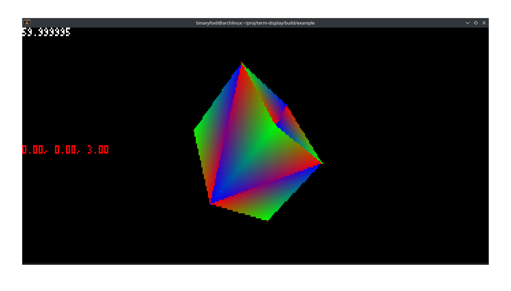

term-display
=====
`term-display` is a **simulated console graphics** library written in C. It aims to provide a rasterizer on a terminal. This is just only a **toy project** so don't expect good performance or usability

## Example
All examples code are distributed under `example` of repo

<p align="center" style="font-size:12px;">cube.c</p>

## Feature
Minimal dependencies requirements make it ideal for small, experimental projects.

- Render a pixel-based screen into your terminal.
- A built-in 3D rasterizer for 3D rendering
- Compatible with third-party image loaders such as `stb_image`.

## Requirements
- A standard C/C++ 11 compiler
- A terminal support ANSI escape sequence on Windows [¹](#compatibility) (**not tested yet**)  or POSIX-compliance OS

## Building
1. Clone the repository and download [cmake](https://cmake.org/download/)
2. Run `cmake <top_dir>` in your designated directory, `<top_dir>` is where this repos was cloned
3. Then run the compiler/project builder generated by cmake
4. All examples are distrubuted under `example` of your build directory

## Contributions
Contributions are welcomed! Feel free to open an issue or submit a pull request with improvements, bug fixing, and suggestions. Your contributions to this project are very valuable for the future of this project.

## Important Notes
If you are considering using `term-display` in a **serious project**, it's better to use an established graphics API/Library such as:
 - SDL, SFML
 - DirectX/Direct3D 11 (Windows only)
 - Vulkan (cross-platform)
### Issues
Currently known issues with `term-display`
 * **Bad Performance**:
   - Rendering complex or large pixel grids in the terminal using `term-display` can be slower compared to alternatives. It is especially worse on virtual environments such as `termux` on mobile, which isn't fully optimized.
   - Completely CPU dependent: means they almost can't leverage anything from GPU, which is heckin' fast.
 - **Low Resolution**: Terminal-based output is limited by the size, resolution of the terminal window.
### Compatibility
- As we knew that Windows Terminal doesn't support ANSI escape code until [Windows version 10.0.10586](https://superuser.com/a/1300251). If you have a older Windows, consider using something like [ConEmu](https://conemu.github.io/) and add this piece to your code:

```cpp
td_display_types type = td_display_truecolor_216;
td_option(td_opt_display_type, 0, &type);
```